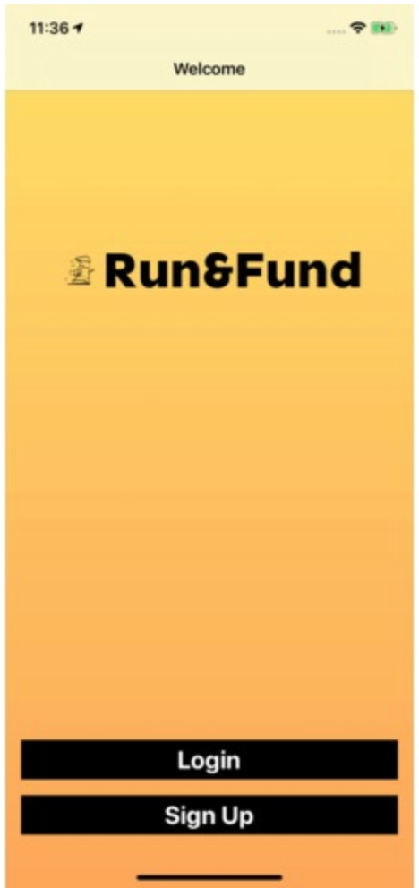
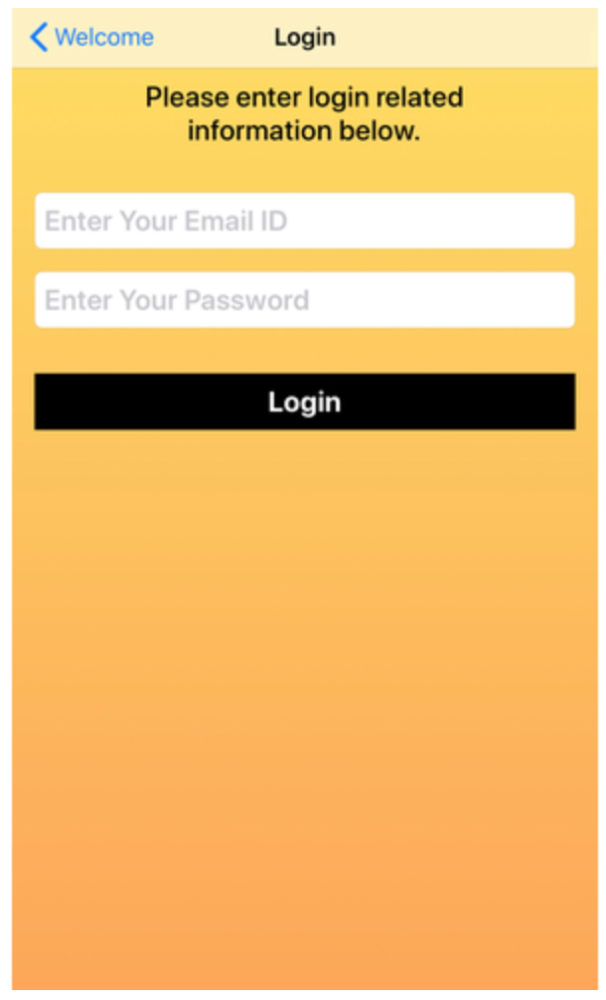
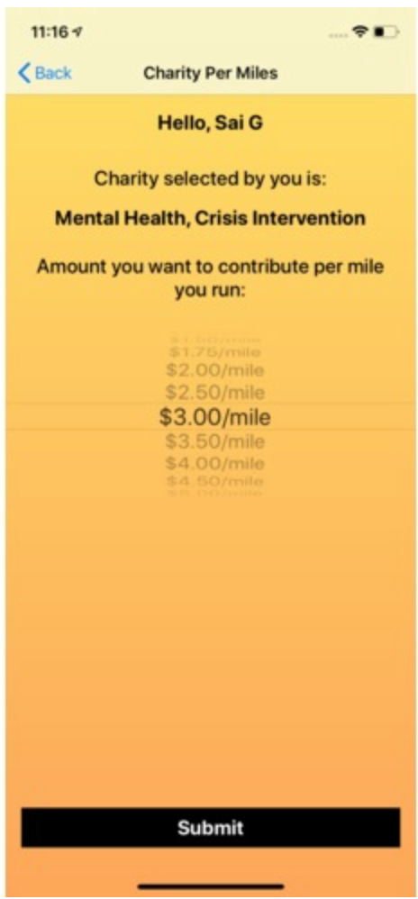
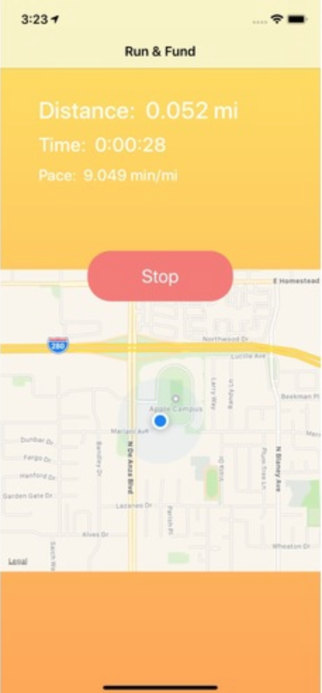
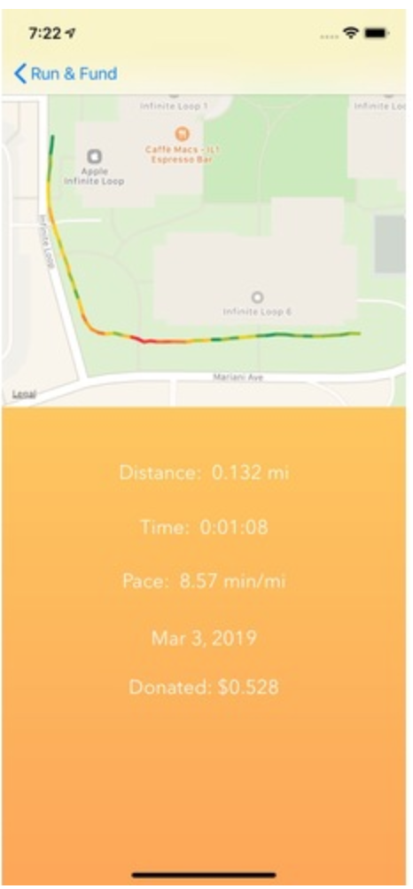

# Run and Fund
> Every mile you run helps those in need.

[![License][license-image]][license-url]
  

Raise money for the charity you support for every mile you run. Stay health philanthropically.

https://gfycat.com/colossalradiantcero

## Screenshots

| Welcome      	  | Login       | Charity Selection     |
| :---        	  |    :----:   |		          ---: |
| |	 |    |

| Fund      	  | Real-time tracking       | Completed run     |
| :---        	  |    :----:   |		          ---: |
| |	 |    |

## Requirements

- iOS 11.0+
- Xcode 9.3+
- Swift 4.2
- Pods: AlamoFire, SwiftyJSON, SVProgressHUD
- Firebase for login and user data store

## Functionality

Run & Fund is an iOS application that allows users to select their favorite charity organization and donate to it based on the number of miles they ran. The application gives users the opportunity to browse several different non-profit organizations and select the one appropriate for them. Then the user can select a fixed rate by which they would like their donations to be sent. Along with this, users can track their runs real-time and see essential quantitative details such as pace, distance, and duration.

## Contribute

We would love you for the contribution to **YourLibraryName**, check the ``LICENSE`` file for more info.

## Meta

Your Name – [@Linkedin](https://linkedin.com/in/sairaghavgr) – sairsmgrandhi@example.com

Distributed under the MIT license

[swift-image]:https://img.shields.io/badge/swift-3.0-orange.svg
[swift-url]: https://swift.org/
[license-image]: https://img.shields.io/badge/License-MIT-blue.svg
[license-url]: LICENSE
[travis-image]: https://img.shields.io/travis/dbader/node-datadog-metrics/master.svg?style=flat-square
[travis-url]: https://travis-ci.org/dbader/node-datadog-metrics
[codebeat-image]: https://codebeat.co/badges/c19b47ea-2f9d-45df-8458-b2d952fe9dad
[codebeat-url]: https://codebeat.co/projects/github-com-vsouza-awesomeios-com